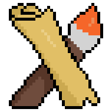

  

<h1 align="center">MapArtist</h1>

  
  
  
  

  A pixel art (map art) builder in Minecraft.

## Feature

:sparkles: Free.  
:sparkles: Open source.  
:sparkles: Moving by walking, flying is not necessary.  
:sparkles: Can be controlled through Discord.  
:sparkles: Multiple bots can work together without any communication.  

## Quick Start

Please see website ([https://juexiuhuang.github.io/MapArtist/](https://juexiuhuang.github.io/MapArtist/)) for more information.

## Roadmap

- Support flying mode

- Add GUI to control the bot
